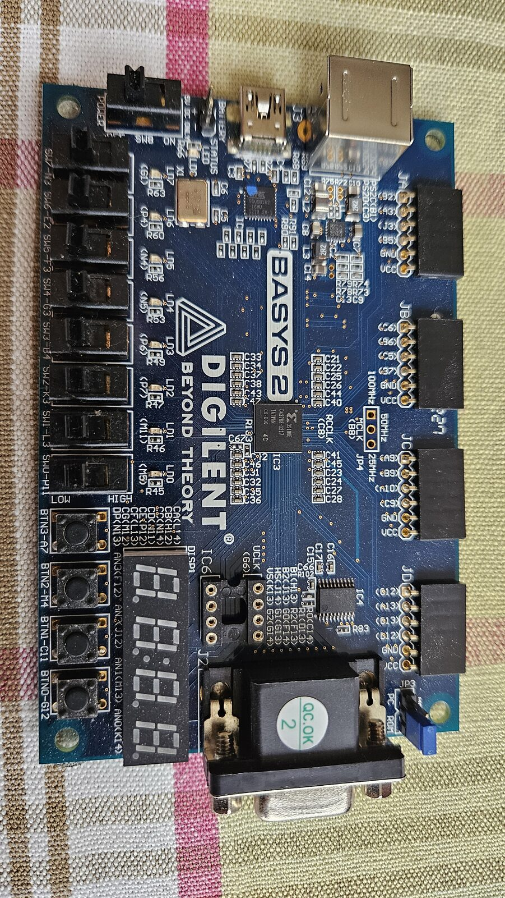
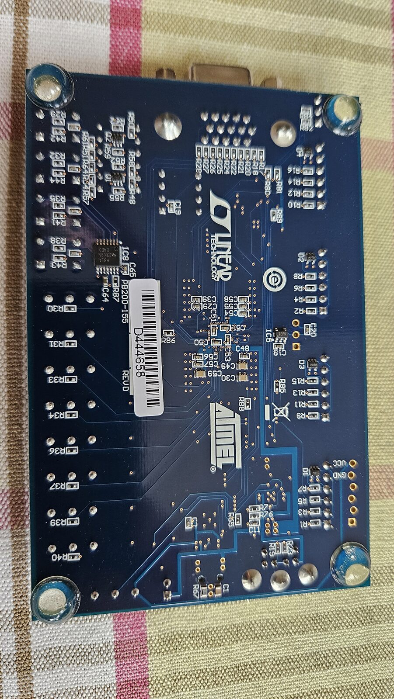

# Basys-2 board: what's on Ben's board

Photos taken 2026-09-28. Pin and net names come from the **Rev D** schematic
(`data/Basys2_sch_revD.pdf`, see [data-inventory.md](data-inventory.md)).

| Top | Bottom |
|---|---|
|  |  |

## Identification

| What | Seen on the board |
|---|---|
| Board revision | **Rev D** (`REVD` and `PB200-155` on the back label) |
| FPGA (IC3) | **XC3S100E**, CP132, speed grade `4C` (-4, commercial temperature range) |
| USB chip (IC1) | Atmel AT90USB series, running Digilent's closed "Adept" firmware (the schematic says AT90USB2; the chip looks like it's marked AT90USB162) |
| Configuration flash (IC4) | XCF02S |
| Main oscillator (IC5, on the back) | LTC6905 → MCLK, FPGA pin **B8** |
| Second-oscillator socket IC6 | **Empty** 8-pin DIP socket → UCLK, FPGA pin M6 |

## Jumpers and switches

| Part | State | Meaning |
|---|---|---|
| **SW8 POWER** | slide switch, OFF/ON | Doesn't switch the power itself. The USB chip reads it and turns the 3.3 V regulator on or off (the `USB-ON` net). |
| **JP4** clock select | **No jumper fitted** (3 empty holes) | The LTC6905's divider pin is left open, so it divides by 2: **MCLK = 50 MHz**. A jumper toward `100MHz` gives 100 MHz; toward `25MHz` gives 25 MHz. The manual says a jumper has to be soldered in. |
| **JP3** PC/ROM | Blue jumper on **ROM** (checked on the board 2026-09-28) | `ROM` means the FPGA loads the design stored in the XCF02S at power-up. `PC` means it waits to be loaded over JTAG. Loading over JTAG works in either position. |

## Power

The power circuit is the same on Rev C and Rev D.

- **USB (the normal way):** a mini-B cable into J3, then SW8 on. The M2 Air
  needs a USB-C to mini-B cable or an adapter. A phone charger works just as
  well as the Mac. The manual says a small design draws about 200 mA in total
  across its supply rails.
- **Battery or bench supply:** use the 2-pin `BATTERY` header J5 (fitted, next
  to SW8). Pin 1 is +, pin 2 is GND. Supply **3.5–5.5 V**; three AA cells work.
  More than 5.5 V can damage the board.
- ⚠️ **Never connect a battery and USB at the same time.** J5 connects
  straight to the USB 5 V line (`USB5V0`) with no protection diode, so the two
  supplies would feed into each other.
- The LTC3545 regulator (IC2) produces three supply rails from 5 V: **3.3 V,
  2.5 V and 1.2 V**.
- The PMOD headers JA–JD supply **3.3 V on pin 6** (`VCC`); pin 5 is GND.
  The manual text says the expansion headers get the raw input voltage, but
  the schematic shows 3.3 V. The PS/2 connector does carry the raw 5 V.

### Measuring the voltages

Set the multimeter to DC volts. Keep the black probe on GND (PMOD pin 5, or
J5 pin 2) and move only the red probe.

| What | Red probe on | Expected | Notes |
|---|---|---|---|
| 5 V input | **J5 pin 1** | 4.75–5.25 V | Present even with SW8 off |
| 3.3 V main supply | **PMOD pin 6** (JA–JD) | ~3.32 V | Only on with SW8 on |
| 3.3 V for the USB chip (`USB3V3`) | J4 pin 6, if J4 is accessible | ~3.3 V | Present whenever the board has power |
| 2.5 V | output capacitor C12 (the side away from GND) | ~2.50 V | Surface-mount part, fine probe tip needed |
| 1.2 V | output capacitor C10 (the side away from GND) | ~1.20 V | Same |

The expected values come from the LTC3545's feedback resistors. It regulates
its feedback pins to 0.6 V, so each output is 0.6 V × (1 + top resistor /
bottom resistor):
- 3.3 V rail: R78/R79 = 453k/100k gives 3.32 V
- 2.5 V rail: R76/R77 = 316k/100k gives 2.50 V
- 1.2 V rail: R73/R74 = 100k/100k gives 1.20 V

Order to measure in:
1. Plug in USB with SW8 off. J5 should read about 5 V, and PMOD pin 6 about 0 V.
2. Turn SW8 on. PMOD pin 6 should read about 3.3 V.

That confirms the power switch and the 3.3 V supply. If 3.3 V is right and
the board runs, the 1.2 V and 2.5 V rails are almost certainly fine too.

Be careful not to bridge PMOD pins 5 and 6 with the probe tip: that shorts
3.3 V straight to GND. PMOD pins 1–4 have 200 Ω resistors in series, so
touching those by mistake is harmless.

## ⚠️ There's no FPGA JTAG header

The Rev D schematic has no header that carries all the FPGA's JTAG signals.
The only connectors are J1 (PS/2), J2 (VGA), J3 (USB), J4, J5 (battery),
JA–JD (PMOD), JP3 and JP4.

- **J4** (1×6) carries ISP-RESET, TDO-USB/TDI-FPGA, TDO-ROM/TDI-USB, TCK, GND
  and USB3V3. That's the **programming header for the USB chip (AVR ISP)**,
  and it has **no TMS**, which JTAG needs. There's no J4 fitted on the top of
  this board.
- **TMS** only connects the USB chip (pin 14), the FPGA (pin B14) and the
  XCF02S (pin 5). It doesn't come out to any header.
- The USB chip is wired straight to TMS, TCK and TDI. An external JTAG
  adapter would be driving the same lines, unless the USB chip is held in
  reset (J4 pin 1, ISP-RESET).

So step 4 of [jtag-ft4232h-basys2.md](jtag-ft4232h-basys2.md) (wiring to "the
6-pin JTAG header") doesn't work on this board as written.

**Decided 2026-09-28:** program through the on-board USB with adepttool
(`bin/basys2`), natively on macOS. See
[programming-options.md](programming-options.md). The options considered:

1. **Solder wires onto the JTAG lines.** Solder TMS, TCK, TDI and TDO onto
   pads or vias, and hold the USB chip in reset. This works, but it means
   modifying the board.
2. **REPORT.md option B:** load open firmware into the board's own USB chip,
   so it can be driven from macOS. The plan assumed a Cypress FX2 chip; on
   this board it's an **Atmel AT90USB**, so that plan needs rechecking.
3. **REPORT.md option C:** Digilent's Adept tools (`djtgcfg`) in a small
   Linux VM, using the on-board USB.
